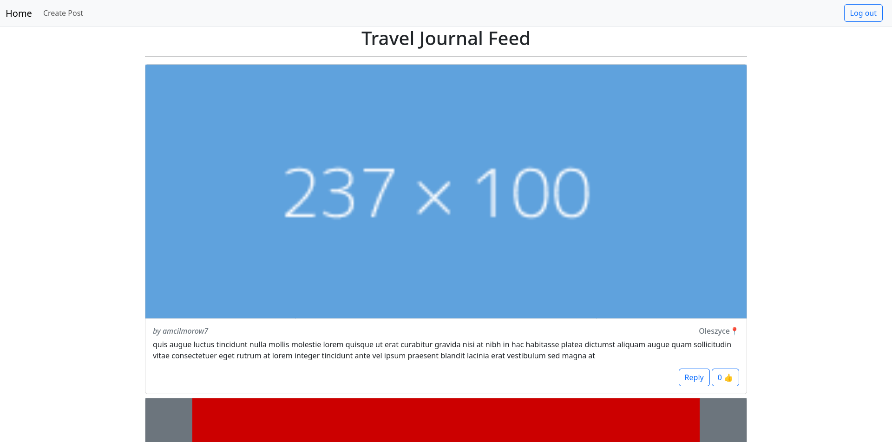

# GCU Senior Project
This repository represents my senior project at Grand Canyon University. It is a mock social media platform intended for sharing travel journals.
## Usage
`docker compose up`
## Frontend

The frontend of this application uses the Nextjs framework, using bootstrapt for styling. The homepage is a feed of all posts. User authentication is done with the NextAuth library. It uses Google OAuth to verify and register users. The frontend interacts with a backend API to interact with the database. It is architected in such a way that all API requests are handled by the server. This way, the API can be protected by a firewall, and obscured from the user. 
### Environment Variables
- API_HOST - API URL
- GOOGLE_CLIENT_ID - Google OAuth clientid
- GOOGLE_CLIENT_SECRET - Google OAuth client secret
- NEXTAUTH_SECRET - NextAuth encryption secret
## API
The backend API uses Expressjs.
### Environment Variables
- MY_SQL_DB_HOST - database URL
- MY_SQL_DB_PORT - database port
- MY_SQL_DB_USER - database user
- MY_SQL_DB_PASSWORD - database password
- MY_SQL_DB_DATABASE - name of database
- MY_SQL_DB_CONNECTION_LIMIT - maximum cuncurrent connections

|method|path|description|
|-|-|-|
| GET  | localhost/api/users/all                          | get all users |
| GET  | localhost/api/users/{userid}                     | get user by userid |
| GET  | localhost/api/users/lookup?googleid={{googleid}} | lookup user by google credential id |
| POST | localhost/api/users                              | create post |
||||
| GET  | localhost/api/posts/all                          | get all primary posts |
| GET  | localhost/api/posts/{postid}                     | get a post and its reply feed |
| GET  | localhost/api/posts/user/{userid}                | get all posts made by a user |
| GET  | localhost/api/api/posts/like/{postid}            | like a post |
| POST | localhost/api/posts                              | create a post |

## Database
User and Post data is stored in a mysql database. The database consists of two tables: users, and posts.
### Users
||||
|-|-|-|
|PK|userid|int|
||name|varchar|
||image|varchar|
||googleid|varchar|
### Posts
||||
|-|-|-|
|PK|postid|int|
|FK|userid|int|
|FK|parent|int|
||body|varchar|
||location|varchar|
||image_url|varchar|
||likes|int|